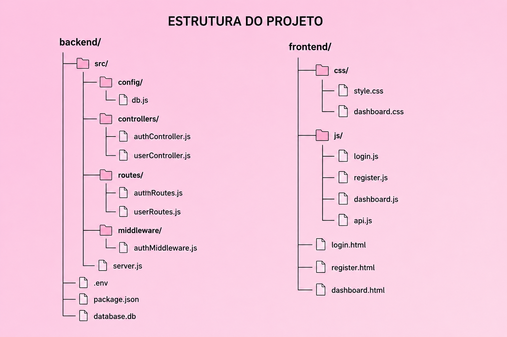

# Bloco-de-Notas
🌸 Blossom Notes — Sistema web de gerenciamento de notas desenvolvido para a disciplina de Projeto Integrador. O projeto possui autenticação de usuários, criação e organização de notas, exportação em PDF e interface moderna inspirada em dashboards minimalistas. Desenvolvido com HTML, CSS, JavaScript, Node.js, Express e SQLite.


---

# ✨ Funcionalidades

* Cadastro de usuários
* Login com autenticação
* Criação de notas
* Exclusão de notas
* Busca de notas em tempo real
* Exportação de notas em PDF
* Interface moderna e responsiva
* Armazenamento em banco SQLite

---

# 🛠️ Tecnologias

<div align="center">


</div>

---





# ⚙️ Como Executar o Projeto

## 1. Instalar dependências

Abra o terminal dentro da pasta backend:

```bash id="q9tb7o"
npm install
```

---

## 2. Configurar o .env

Criar um arquivo chamado:

```bash id="3k7mvp"
.env
```

Conteúdo:

```env id="c0mf3r"
PORT=3001

JWT_SECRET=blossom_secret_key
```

---

## 3. Iniciar servidor

```bash id="x2s9pl"
npm start
```

Servidor:

```bash id="wt8f4z"
http://localhost:3001
```

---

## 4. Abrir frontend

Abra o arquivo:

```bash id="2hf7cm"
login.html
```

---

# 🗄️ Banco de Dados

O sistema utiliza SQLite para armazenamento local.

Tabelas:

* users
* notes

---

# 📌 Objetivo do Projeto

O objetivo do projeto foi desenvolver uma aplicação completa envolvendo:

* frontend
* backend
* banco de dados
* autenticação
* persistência de dados
* design responsivo

Aplicando os conhecimentos estudados durante a disciplina de Projeto Integrador.

---

# 👨‍🏫 Professor

Lucas

---

# 🤖 Observação

Durante o desenvolvimento do projeto, ferramentas de Inteligência Artificial foram utilizadas como apoio para:

* organização do código
* melhorias visuais
* estruturação do sistema
* otimização do desenvolvimento

Todo o projeto foi estudado, adaptado e integrado manualmente para atender aos requisitos da disciplina.

---

# 🌸 Blossom Notes

Projeto acadêmico desenvolvido para fins educacionais.
